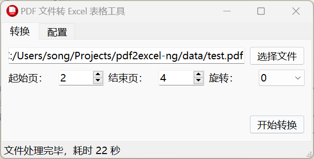

# PyQt Template
> My PyQt template.


<p>
  <a href="https://raw.githubusercontent.com/songquanpeng/pyqt-template/main/LICENSE">
    
  </a>
  <a href="https://github.com/songquanpeng/pyqt-template/releases/latest">
    
  </a>
  <a href="https://github.com/songquanpeng/pyqt-template/releases/latest">
    
  </a>
</p>

可在 [Release 页面](https://github.com/songquanpeng/pyqt-template/releases)下载最新版本（Windows，macOS，Linux）。

## 功能
TODO

## 截图展示


## 使用方法
### Windows 用户  
直接双击 pyqt-template.exe 运行。

### macOS 用户
1. 给执行权限：`chmod u+x pyqt-template-macos`；
2. 之后直接双击运行 pyqt-template-macos 或在终端中运行都可。

### Linux 用户
同上，区别在于文件名换成 `pyqt-template`。

## 打包流程
```bash
pip install -r requirements.txt
pyuic5 -o ui.py main.ui
pyrcc5 -o resource_rc.py resource.qrc 
pyinstaller --noconsole -F ./main.py --icon icon.png -n pyqt-template.exe
```
